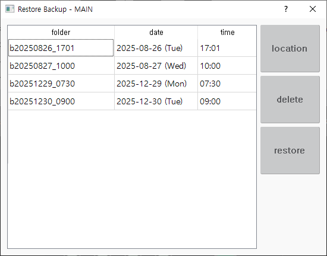

# 2.3 恢复

Navigate to `[F2: 系统] - 2: 控制参数 - 8: Automatic backup & restoration ([F2: system] - 2: Control parameter - 8: Automatic backup & restoration)`.

Click the [F1: Restore] button to display the screen shown below.

The list box displays available restore points sorted by the time they were backed up.
The item at the bottom of the list is the most recent backup point.

* `[Delete]`: Select the items to delete and press this button. After user confirmation, the selected folders are deleted.

* `[Restore]`: Select the item to restore and press this button. After user confirmation, the restore process begins.

When the restore process is completed, a message like the one shown below is displayed.
After re-power the system, the system will be ready for normal operation.

